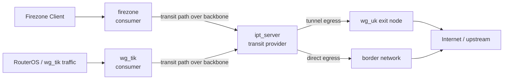
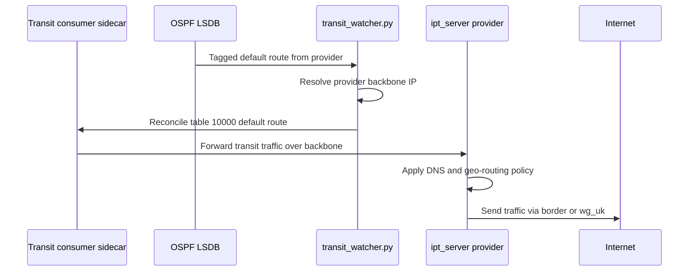

# Transit Path And Transit Consumers

This document explains the business meaning of transit routing in `garuda`.

Use it when you need to understand:

- what a transit consumer is
- what a transit path is
- why `ipt_server` is treated as a transit provider
- why `transit_watcher.py` exists
- how the `garuda.transit.*` labels map to runtime behavior

This document is specific to FRR transit behavior, so it lives next to the
[`frr_injector`](README.md) package that owns the transit label contract.

## Core Idea

In this project, some workloads receive client or tunnel traffic but should not
make the final egress decision themselves.

Instead, they forward that traffic to `ipt_server`, which acts as the central
transit decision point.

`ipt_server` then applies the project-specific policy:

- DNS interception
- geo-routing
- choice of direct exit via `border`
- choice of tunnel exit via `wg_uk`

So transit routing is not just "send traffic to the internet". It is "send
traffic to the workload that owns the project's egress policy".

## Definitions

### Transit provider

The transit provider is the workload that advertises "send transit traffic to
me".

In the current `test-config/vpn2` topology, that workload is `ipt_server`.

It is marked with:

```text
garuda.transit.provider=true
```

This label means:

- the workload advertises a tagged OSPF default route
- the workload is the next transit hop for consumers
- the workload owns the business policy for further routing decisions

In [the `test-config/vpn2` root topology](../../../../../test-config/vpn2/main.tf):

```hcl
labels = {
  "garuda.operator-scope"             = "backbone_network"
  "garuda.frr.ospf.enabled"           = "true"
  "garuda.frr.ospf.router_id"         = local.workload_facts.ipt_server.frr_router_id
  "garuda.frr.ospf.interfaces"        = "backbone"
  "garuda.frr.ospf.active_interfaces" = "backbone"
  "garuda.frr.ospf.default_originate" = "true"
  "garuda.frr.ospf.redistribute"      = "kernel"
  "garuda.transit.provider"           = "true"
}
```

### Transit consumer

A transit consumer is a workload that receives traffic on one or more ingress
interfaces and must forward that traffic to the transit provider.

It is marked with:

```text
garuda.transit.interfaces=<csv>
```

This label means:

- traffic entering those interfaces should be transit-steered
- the FRR sidecar should run `transit_watcher.py`
- the sidecar should maintain a transit routing table pointing at the current
  transit provider

In the current `test-config/vpn2` topology, the consumers are:

- `firezone` with `garuda.transit.interfaces=wg-firezone`
- `wg_tik` with `garuda.transit.interfaces=wg_tik`

Examples from [the `test-config/vpn2` topology facts](../../../../../test-config/vpn2/locals.tf):

```hcl
firezone = {
  labels = {
    "garuda.frr.ospf.enabled"           = "true"
    "garuda.frr.ospf.router_id"         = "10.130.30.22"
    "garuda.frr.ospf.interfaces"        = "wg-firezone"
    "garuda.frr.ospf.active_interfaces" = ""
    "garuda.frr.ospf.default_originate" = "false"
    "garuda.transit.interfaces"         = "wg-firezone"
  }
}

wg_tik = {
  labels = {
    rutestvpn = {
      "garuda.frr.ospf.enabled"           = "true"
      "garuda.frr.ospf.router_id"         = "10.130.30.21"
      "garuda.frr.ospf.interfaces"        = "wg_tik"
      "garuda.frr.ospf.active_interfaces" = "wg_tik"
      "garuda.frr.ospf.default_originate" = "false"
      "garuda.transit.interfaces"         = "wg_tik"
    }
  }
}
```

### Transit path

The transit path is the path from a transit consumer to the transit provider.

In this project, that path is usually:

1. traffic enters a consumer on a client-facing or tunnel-facing interface
2. policy routing in the consumer sends that traffic into the transit table
3. the transit table points to `ipt_server` over `backbone_network`
4. `ipt_server` decides the final egress path

That means the transit path is not the final internet path.

It is the path to the workload that owns the project's egress policy.

## Why The Project Needs This Split

Without the transit concept, every ingress workload would have to duplicate the
same routing policy:

- know who currently provides transit
- know the provider IP
- decide direct exit versus tunnel exit
- react when OSPF reconverges

That would spread policy across multiple independent workloads.

Instead, the project centralizes the business decision in `ipt_server`:

- consumers only need to know how to reach the provider
- `ipt_server` owns the policy for what happens next

This gives a cleaner separation:

- consumer: "this traffic must go to the transit policy node"
- provider: "I decide where this traffic leaves the system"

## Current test-config/vpn2 Topology

The live `rutestvpn` topology confirms this arrangement:

- `firezone-firezone-1` is attached to `backbone_network` with `172.30.0.10`
- `wg_tik-wg_tik-1` is attached to `backbone_network` with `172.30.0.2`
- `ipt_server-garuda_ipt-1` is attached to:
  - `backbone_network` with `172.30.0.100`
  - `border_network` with `172.29.0.3`
- `wg_uk-wg_uk-1` is attached to:
  - `backbone_network` with `172.30.0.3`
  - `border_network` with `172.29.0.2`

This matters because:

- consumers sit on `backbone_network`
- the transit provider sits on `backbone_network` so consumers can reach it
- the transit provider also sits on `border_network` so it can choose direct
  egress when policy says so

## Topology Diagram



## Control Plane And Data Plane

The control plane decides who the provider is.
The data plane forwards traffic to that provider.



## What `transit_watcher.py` Actually Does

`transit_watcher.py` does not choose the final exit path.

It only keeps the consumer's runtime forwarding aligned with the current
provider selected by the control plane.

Its job is:

1. read OSPF external LSAs with the configured transit tag
2. resolve the advertising router into a reachable backbone IP
3. reconcile the consumer-side transit routing table
4. add or remove `ip rule` entries for the declared transit interfaces

Business meaning:

- if OSPF reconverges and the provider next hop changes, the consumer should
  still send traffic to the current transit provider without restart
- if no provider is currently reachable, the transit-specific steering should be
  withdrawn rather than pointing to stale state

## What `transit_watcher.py` Does Not Do

`transit_watcher.py` is not responsible for:

- deciding whether traffic should leave via `border` or `wg_uk`
- implementing DNS interception
- implementing geo-routing policies
- creating Docker networks
- rendering FRR intent from labels

Those responsibilities belong elsewhere:

- final egress decision: [ipt_server](../../../../ipt_server/files/ipt-server/readme.md)
- transit label parsing and env delivery: [FRR injector](README.md)
- consumer-side route and `ip rule` reconcile: [transit watcher](../../frr_sidecar/transit_watcher.py)
- shared network ownership: [Network Manager](../network_manager/README.md)

## Configuration Examples

### Provider example: `ipt_server`

Use `garuda.transit.provider=true` when a workload should advertise itself as the
project's transit decision point.

```hcl
module "ipt_server_main" {
  source = "../../modules/ipt_server"

  nic_attach    = ["backbone", "border"]
  backbone_ip   = local.workload_facts.ipt_server.backbone_ip
  dataplane_ip  = local.workload_facts.ipt_server.dataplane_ip
  frr_router_id = local.workload_facts.ipt_server.frr_router_id

  labels = {
    "garuda.operator-scope"             = "backbone_network"
    "garuda.frr.ospf.enabled"           = "true"
    "garuda.frr.ospf.router_id"         = local.workload_facts.ipt_server.frr_router_id
    "garuda.frr.ospf.interfaces"        = "backbone"
    "garuda.frr.ospf.active_interfaces" = "backbone"
    "garuda.frr.ospf.default_originate" = "true"
    "garuda.frr.ospf.redistribute"      = "kernel"
    "garuda.transit.provider"           = "true"
  }
}
```

Why:

- `ipt_server` must be reachable from all transit consumers over `backbone`
- it must also be able to exit via `border` or tunnel out via `wg_uk`
- it advertises the tagged OSPF default that consumers track

### Consumer example: `firezone`

Use `garuda.transit.interfaces=wg-firezone` when traffic entering `wg-firezone`
must be handed to the transit provider.

```hcl
module "firezone_main" {
  source = "../../modules/firezone"

  backbone_network_name = "backbone_network"
  backbone_ip           = local.workload_facts.firezone.backbone_ip
  ipt_router_ip         = local.workload_facts.ipt_server.backbone_ip
  client_interface      = local.workload_facts.firezone.client_interface

  labels = {
    "garuda.frr.ospf.enabled"           = "true"
    "garuda.frr.ospf.router_id"         = "10.130.30.22"
    "garuda.frr.ospf.interfaces"        = "wg-firezone"
    "garuda.frr.ospf.active_interfaces" = ""
    "garuda.frr.ospf.default_originate" = "false"
    "garuda.transit.interfaces"         = "wg-firezone"
    "garuda.operator-scope"             = "backbone_network"
  }
}
```

Why:

- Firezone receives client traffic on `wg-firezone`
- that traffic should not be locally egressed by Firezone
- it should be handed to `ipt_server`, which owns DNS and geo-routing policy

### Consumer example: `wg_tik`

Use `garuda.transit.interfaces=wg_tik` when traffic entering the RouterOS tunnel
must be handed to the transit provider.

```hcl
labels = merge(local.tunnel_facts.wg_tik.labels.rutestvpn, {
  "garuda.operator-scope" = "backbone_network"
})
```

The merged label set includes:

```hcl
{
  "garuda.frr.ospf.enabled"           = "true"
  "garuda.frr.ospf.router_id"         = "10.130.30.21"
  "garuda.frr.ospf.interfaces"        = "wg_tik"
  "garuda.frr.ospf.active_interfaces" = "wg_tik"
  "garuda.frr.ospf.default_originate" = "false"
  "garuda.transit.interfaces"         = "wg_tik"
}
```

Why:

- `wg_tik` is an ingress point for RouterOS-related traffic
- it should forward transit traffic to `ipt_server` instead of owning duplicate
  egress policy locally

## Runtime Evidence From test-config/vpn2

The `test-config/vpn2` verification checklist already encodes the expected runtime
contract:

- consumer sidecar has `ip rule` for the ingress interface
- consumer sidecar has `table 10000` default route via `172.30.0.100`
- provider sidecar advertises a tagged type-5 default LSA

Examples from [the `test-config/vpn2` verification checklist](../../../../../test-config/vpn2/checklist.md):

```bash
ssh vpn.example.com "sudo docker exec ospf-firezone-firezone-1 ip rule show | grep 10000"
ssh vpn.example.com "sudo docker exec ospf-firezone-firezone-1 ip route show table 10000"
ssh vpn.example.com "sudo docker exec ospf-ipt_server-garuda_ipt-1 vtysh -c 'show ip ospf database external'"
```

Expected meaning:

- consumer data plane points at the current provider
- provider control plane advertises the transit default

## Summary

- transit consumer = ingress workload that forwards marked traffic to the
  transit provider
- transit provider = workload that owns project-specific egress policy
- transit path = consumer-to-provider path over `backbone_network`
- `ipt_server` is the current transit provider in `test-config/vpn2`
- `firezone` and `wg_tik` are current transit consumers in `test-config/vpn2`
- `transit_watcher.py` keeps consumer runtime routing aligned with the current
  provider chosen by OSPF

## Key Code Entry Points

- [Transit label model](transit_config.py)
- [FRR consumer](consumer.py)
- [Transit watcher runtime](../../frr_sidecar/transit_watcher.py)
- [Provider topology wiring](../../../../../test-config/vpn2/main.tf)
- [Consumer topology facts](../../../../../test-config/vpn2/locals.tf)
